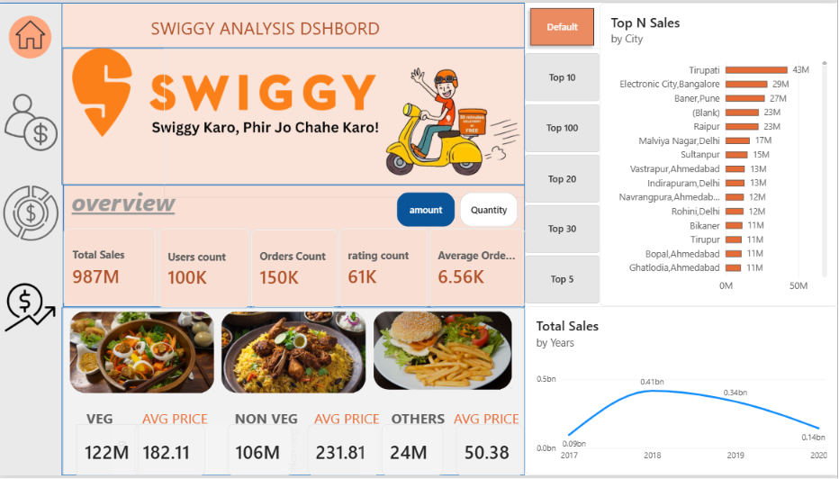
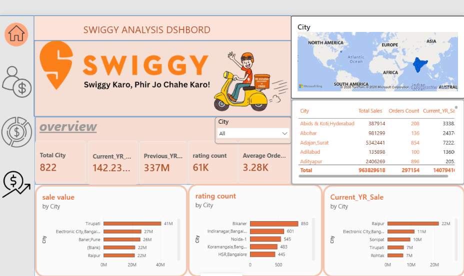
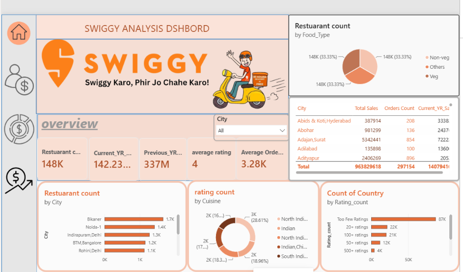
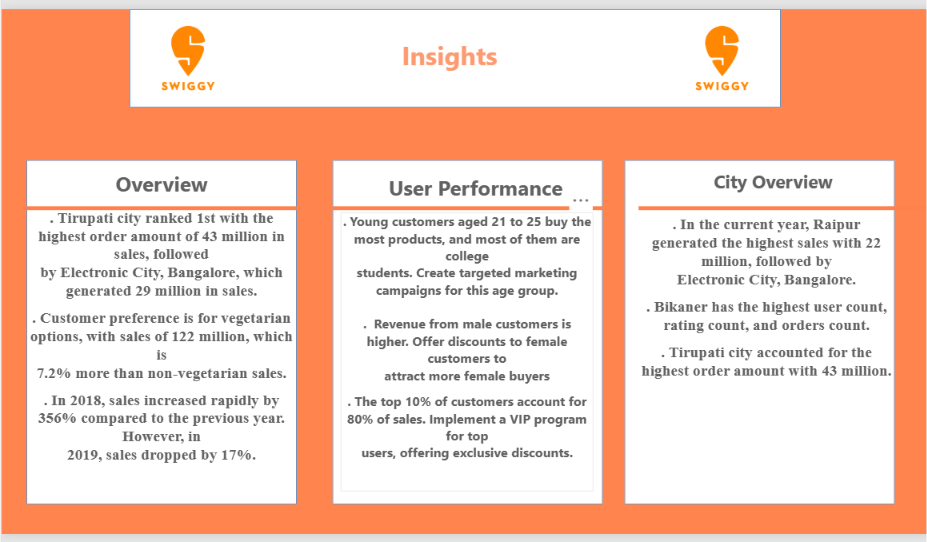

# 🍽️ Swiggy Data Analytics & Restaurant Rating Prediction

## 📌 Project Overview

This project demonstrates an end-to-end **Data Analytics** workflow using the Swiggy dataset. It covers database design, business analysis, interactive dashboards, and a machine learning model for restaurant rating prediction.

---

## 🎯 Objectives

- Analyze restaurant and order data
- Build an interactive Power BI dashboard
- Generate business insights using KPIs
- Predict whether a restaurant is highly rated using Machine Learning

---

## 🛠️ Tech Stack

- MySQL
- Power BI
- Python
- Pandas
- NumPy
- Scikit-learn

---

## 📊 Dashboard Pages

## 1️⃣ Executive Overview




### Highlights
- Total Sales
- Total Orders
- Total Users
- Average Order Value
- Food Category Performance
- Monthly Sales Trend

## 2️⃣ User Performance Dashboard


### Highlights
- User Distribution by Age
- Sales by Gender
- Occupation Analysis
- Year-wise Sales Comparison

## 3️⃣ City Overview Dashboard



### Highlights
- Revenue by City
- Orders by City
- Rating Count
- Interactive City Map

## 4️⃣ Restaurant Overview Dashboard



### Highlights
- Restaurant Distribution
- Cuisine Analysis
- Restaurant Ratings
- Top Performing Restaurants

## 5️⃣ Business Insights



### Key Insights
- Top performing cities
- Customer purchasing behaviour
- Restaurant performance
- Revenue opportunities
- Business recommendations

## 🤖 Machine Learning

### Problem Statement

Predict whether a restaurant is **High Rated** or **Low Rated**.

### Features Used

- Country
- City
- Cuisine
- Rating Count

### Model

- Random Forest Classifier

### Current Results

| Metric | Score |
|--------|-------:|
| Accuracy | 60.37% |
| Precision | 61.01% |
| Recall | 61.44% |
| F1 Score | 61.23% |

---

## 📂 Project Structure

```text
Data/
PowerBI_Dashboard_Images
Machine_Learning/
README.md
requirements.txt
```

---

## 🚀 Future Improvements

- Feature engineering using SQL joins
- Additional ML models (XGBoost, LightGBM)
- Hyperparameter tuning
- Power BI dashboard enhancements
